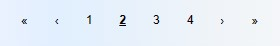

# 롤매드무비 Next.js

# <https://nextmadmovie.vercel.app>

# **롤매드무비** 배경

기존의 <a href='https://lolmadmovie.vercel.app'>롤매드무비</a>의 단점을 보완하고자 Next.js로 개발</br>

## 기존의 롤매드무비 사이트의 문제와 해결

## 1. 카카오톡이나 디스코드 등 사이트에 링크 공유시 각각 페이지마다 SEO OG(Open Graph)가 동적으로 할당되지 못함
  <p align="center">

  <p>문제</p>


  <p>=> Next.js의 SSR을 이용해 OG(Open Graph)를 동적으로 할당</p>
</p>

   ```javascript
   export async function generateMetadata({ params: { date } }) {
     const title = `${dateSplit(date)}의 영상들`;
     const desc = `${dateSplit(date)}의 하이라이트`;
     return {
       title: title,
       description: desc,
       openGraph: {
         title: title,
         description: desc,
         site_name: "LOL MAD MOVIE",
       },
       robots: {
         index: false,
         follow: true,
         nocache: true,
       },
     };
 }
  ```

## 2. 하드코딩된 오래된 코드들을 수정하는것보다 새로 만드는것이 낫다는 판단

   => 두서없던 오래된 코드들을 재정비

  ```javascript
    const FHD221004 = [
        ["킨드 궁에서 꺼내는 우르곳",
            "https://www.youtube.com/watch?v=3CdHCl5Q9yA"],
        ["애매한 이니시 성공",
            "https://www.youtube.com/watch?v=a5g7pPqxWNo"],
        ["브랜드 살리기",
            "https://www.youtube.com/watch?v=DsVd_Hp0FHo"],
    ]
    // 이런 식으로 하드코딩된 플레이리스트들을 따로 추출해 재정렬
  ```


## 3. 플레이리스트를 업로드하기 어려움

  </br>
    => 유튜브 스튜디오 페이지에서 업로드한 영상 정보들을 JSON형식으로 크롤링하여 업로드</br>

 <p align="center">
    
     
  <p>기존에는 유튜브 스튜디오에서 일일이 제목과 링크를 복사붙여넣기를 했어야함</p>
    
    
  <p>유튜브 스튜디오에서 해당 일자의 영상들을 플레이리스트 오브젝트로 만들어 출력된 내용을 복사붙여넣기함</p>
</p>

## 4. 플레이리스트 수정, 삭제 기능 없음

  </br> 
   <p align="center">
    <p>=> 플레이리스트 수정, 삭제 기능 추가</p>
    
  </p>

## 5. 검색 기능 없음

  </br>
   <p align="center">
    <p> => 검색 기능 추가</p>
    
  </p>

## 6. 페이지네이션이 제대로 구현되지 못함

  </br>

  <p>

  <p>어느 페이지를 눌렀는지 모르는 문제, 페이지 번호 출력범위 제한 없는 문제</p>

  <p>최대 4페이지까지 보이도록 하고 맨 앞, 맨 뒤, 이전, 다음 버튼 추가</p>
</p>


## 프로젝트 디렉터리 구조
```bash
nextmadmovie
├─app
│  ├─(route)
│  │  ├─edit
│  │  ├─upload
│  │  └─[date]
│  ├─api
│  │  ├─playlist
│  │  │  └─[date]
│  │  └─[id]
│  └─_components
├─context
├─libs
└─models

```

## ⚙ 사용 기술

### :earth_africa: Environment

<div>
    
    
</div>

<br />

### :pick: Development

<div>
    
    
  
  
</div>

<br />
